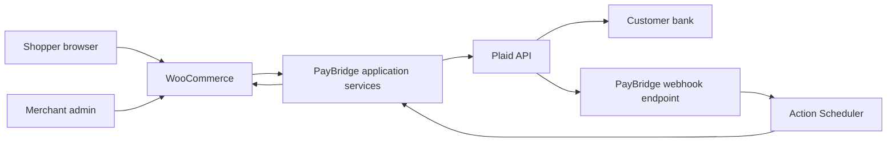

# Architecture

## 1. System context



PayBridge is an orchestration layer. It must not become an independent ledger or duplicate WooCommerce order ownership.

## 2. Dependency direction

```text
Adapters (WordPress/WooCommerce/REST/Admin)
                 ↓
Application services
                 ↓
Payment domain
                 ↓
Ports/interfaces
        ↙                 ↘
Plaid adapter        Persistence adapter
```

Provider DTOs may exist inside `src/Plaid`, but provider wire formats should be normalized before entering general payment-domain code.

## 3. Core components

### `PayBridgeGateway`

WooCommerce adapter. Handles settings/availability and delegates payment initiation.

### `PaymentAttemptService`

Creates/reuses the local payment attempt and coordinates the lock, snapshot and provider intent.

### `PaymentSnapshot`

Immutable representation of what is being paid.

### `TransferIntentService`

Plaid-specific orchestration for `/transfer/intent/create` and `/transfer/intent/get`.

### `LinkTokenService`

Creates short-lived Link tokens for the exact stored Transfer Intent.

### `PaymentCompletionService`

Handles browser completion signal by fetching provider truth and projecting safe state.

### `WebhookVerificationService`

Authenticates Plaid webhooks before any business mutation.

### `EventSyncService` / `TransferEventStore` / `TransferEventProcessor`

`EventSyncService` calls `/transfer/event/sync` for ONE Plaid event stream (`Settings\AccountScope`:
environment + account fingerprint, ADR-0018), stores every event durably before advancing that
stream's cursor, and processes stored events under leases; `TransferEventProcessor` applies payment
events (and routes refund events to `RefundEventHandler`). Every correlation stays inside the scope.

### `PaymentStateMachine`

The only component permitted to decide allowed payment-state transitions.

### `OrderPaymentProjector`

Maps domain payment state to WooCommerce order status/meta/notes.

### `DatabaseMutex` / `PaymentLockStore`

`DatabaseMutex` serializes payment, refund, event-sync and reconciliation work;
`PaymentLockStore` is the durable reservation and payment index (one row per order).

### `ReconciliationService` / `Scheduler`

Repairs stale/ambiguous local states from authoritative Plaid APIs: event catch-up, due
payments (`/transfer/get`), due refunds (`/transfer/refund/get`), bounded backfill. Runs whether
or not the gateway accepts new payments (ADR-0014), and only while there is work: the gateway
accepts payments, or the configured account has monitored payments, open refunds, stored events to
process or a failed event sync (`Scheduler::pending_work()`, ADR-0021).

### `MonitoringPolicy` / `PaymentMonitor`

Decide when a payment must be re-read and until when it is monitored, from the Plaid transfer
lifecycle and return windows (never the order date); project state and schedule into the
payment index.

### Refund domain (`src/Refund/`, ADR-0016)

`RefundPolicy` (eligibility, exact remaining amount), `RefundService` (idempotent creation,
ambiguity resolution, status projection, return-after-refund protection — implements the
payment domain's `ReturnListener`), `RefundStateMachine`, `RefundEventHandler` (refund events
from the same verified pipeline), `RefundMonitoringPolicy`, `WooRefundContext` (binds the
WooCommerce refund object). Persistence: `Persistence\RefundStore`. Plaid adapter:
`Plaid\Refund\TransferRefundService`.

### `AttemptHistory` (ADR-0017)

Archives a complete payment attempt before a new one replaces it; money-moving attempts are
never dropped.

### `ReturnRetryPolicy` / `ReturnRetryDecision` (ADR-0019)

Decides whether a new bank debit may be originated for an order whose transfer was returned, from
Plaid's reprocessing rules (R01/R09 only, two retries, 180 days, "Retry 1/2" on `/transfer/create`)
and the origination flow. Transfer UI cannot mark retries, so every returned order is blocked; the
attempt service, gateway availability, payment page, REST route and manual review all ask it.

### `AccountChangeGuard` (ADR-0015)

Refuses Plaid account/environment changes while Production payments or refunds are monitored.

### `ManualActions`

Explicit merchant actions (cancel a cancellable transfer, resolve manual review), each under the
payment mutex and re-reading Plaid first.

### Admin (`ConfigurationStatus`, `ConnectionTester`, `DiagnosticsPage`, `SiteHealth`, `OrderMetaBox`, `OrderListColumn`, `AdminNotices`)

Local-data status and diagnostics (no Plaid call on page view), classified connection test,
order panel with attempts/refunds/actions, orders-list badge, persistent alerts.

## 4. Command/query separation

Provider-changing operations and provider-reading operations must be distinguishable.

Commands:

- create Transfer Intent;
- create Link session;
- create refund (idempotency key);
- cancel refund (only pending refunds of a returned debit);
- cancel transfer (explicit merchant action only).

Queries:

- get Transfer Intent;
- get Transfer (incl. return windows, cancellable, refunds);
- get refund;
- event sync;
- verification-key get;
- transfer configuration / ledger (connection test).

Read operations used for reconciliation should be safe to repeat.

## 5. Data ownership

WooCommerce owns order facts. PayBridge stores integration projection/meta plus custom operational tables.

Plaid owns provider-side transfer lifecycle.

Never copy provider data into local storage unless needed for:

- correlation;
- state projection;
- audit/support;
- recovery.

## 6. Failure containment

Each boundary converts errors to typed internal errors:

```text
WP HTTP error
→ PlaidNetworkException

Plaid API error JSON
→ PlaidApiException

invalid webhook
→ WebhookVerificationException

invalid transition
→ InvalidPaymentStateTransition

missing account-holder legal name
→ MissingAccountHolderNameException

lock contention
→ PaymentAttemptBusyException
```

Customer output must not expose raw provider responses.

## 7. No hidden side effects

Constructors must not call Plaid, schedule actions, mutate orders, or write database rows.

Remote calls occur through explicit service methods.

## 8. Extensibility

Future payment rails/providers must extend through explicit strategies rather than conditionals spread throughout WooCommerce code.

Do not over-generalize MVP. Introduce interfaces when there is a real boundary, not merely to increase class count.
